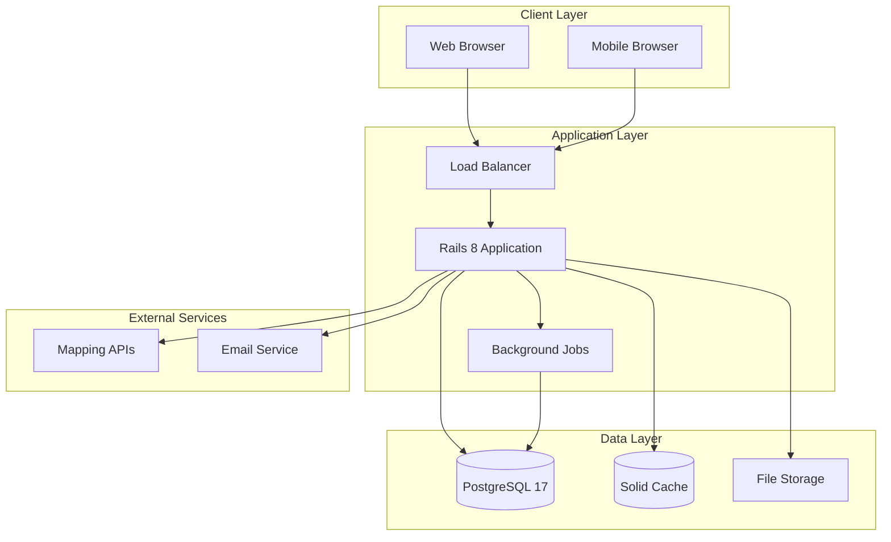
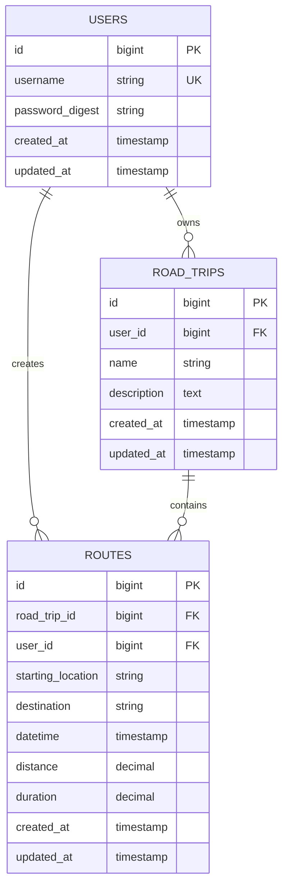
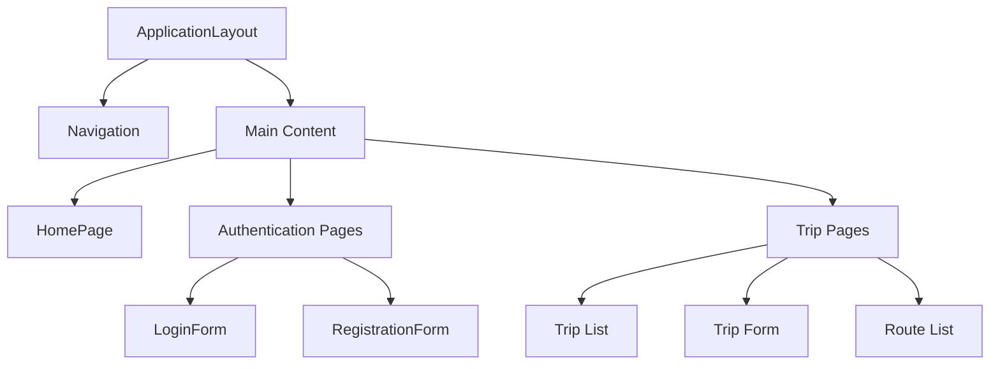
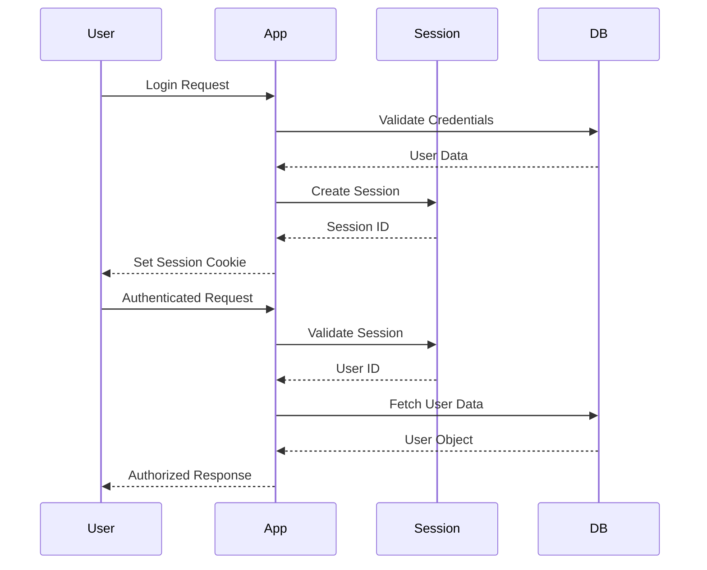

# Architecture Overview

Roadtrip Planner follows modern Rails conventions with a component-based frontend architecture, emphasizing maintainability, testability, and performance.

## High-Level Architecture



## Application Structure

### Rails 8 Architecture

The application leverages Rails 8's modern architecture:

- **Solid Stack**: Database-backed solutions for caching, queuing, and real-time features
- **Propshaft**: Modern asset pipeline for optimized delivery
- **Component-Based Views**: Phlex components instead of traditional ERB
- **Hotwire**: Turbo and Stimulus for SPA-like experience

### Directory Organization

```
app/
├── components/          # Phlex view components
│   ├── application_component.rb
│   ├── layouts/        # Layout components
│   ├── shared/         # Reusable components
│   └── features/       # Feature-specific components
├── controllers/        # Rails controllers
├── models/            # ActiveRecord models
├── services/          # Business logic services
├── jobs/              # Background jobs
├── mailers/           # Email templates
├── javascript/        # Stimulus controllers
└── assets/            # Stylesheets and images
```

## Architectural Patterns

### 1. Component-Driven Development

**Phlex Components** replace traditional Rails views:

```ruby
class ButtonComponent < ApplicationComponent
  def initialize(text:, variant: :primary, **options)
    @text = text
    @variant = variant
    @options = options
  end

  def view_template
    button(**attributes) { @text }
  end

  private

  def attributes
    {
      class: button_classes,
      **@options
    }
  end

  def button_classes
    case @variant
    when :primary
      "bg-primary-600 text-white hover:bg-primary-700"
    when :secondary
      "bg-gray-200 text-gray-900 hover:bg-gray-300"
    end
  end
end
```

**Benefits:**
- Type safety and IDE support
- Reusable, testable components
- Clear separation of concerns
- Ruby-native templating

### 2. Service Objects Pattern

Business logic is extracted into service objects:

```ruby
class RouteDistanceCalculator
  def initialize(start_location, end_location)
    @start_location = start_location
    @end_location = end_location
  end

  def calculate
    {
      distance: calculated_distance,
      duration: calculated_duration
    }
  end

  private

  def calculated_distance
    # Distance calculation logic
  end

  def calculated_duration
    # Duration calculation logic
  end
end
```

**Benefits:**
- Single responsibility principle
- Testable business logic
- Reusable across controllers/jobs
- Clear interfaces

### 3. Domain-Driven Design

Models represent clear business domains:

- **User**: Authentication and user management
- **RoadTrip**: Trip planning and organization
- **Route**: Individual trip segments

```ruby
class RoadTrip < ApplicationRecord
  belongs_to :user
  has_many :routes, dependent: :destroy

  validates :name, presence: true
  
  def total_distance
    routes.sum(&:distance_in_km)
  end
  
  def day_count
    # Business logic for calculating trip duration
  end
end
```

## Data Architecture

### Database Design



### Key Relationships

- **User** has many **RoadTrips** and **Routes**
- **RoadTrip** belongs to **User** and has many **Routes**
- **Route** belongs to both **User** and **RoadTrip**

This design ensures:
- Data integrity through foreign keys
- User ownership validation
- Efficient querying with proper indexes

## Frontend Architecture

### Component Hierarchy



### Styling Architecture

**Tailwind CSS v4** with systematic approach:

```css
/* app/assets/stylesheets/application.tailwind.css */
@import "tailwindcss/base";
@import "tailwindcss/components";
@import "tailwindcss/utilities";

/* Custom component styles */
@layer components {
  .btn-primary {
    @apply bg-primary-600 text-white px-4 py-2 rounded hover:bg-primary-700;
  }
}
```

**Benefits:**
- Utility-first approach
- Consistent design system
- Responsive by default
- Easy customization

### JavaScript Architecture

**Stimulus Controllers** for progressive enhancement:

```javascript
// app/javascript/controllers/form_controller.js
import { Controller } from "@hotwired/stimulus"

export default class extends Controller {
  static targets = ["output"]
  
  connect() {
    // Initialize form behavior
  }
  
  submit(event) {
    // Handle form submission
  }
}
```

## Security Architecture

### Authentication Flow



### Security Measures

- **Password Hashing**: bcrypt with secure defaults
- **Session Management**: Rails secure sessions
- **CSRF Protection**: Built-in Rails protection
- **SQL Injection Prevention**: ActiveRecord parameterized queries
- **XSS Prevention**: Automatic output escaping in Phlex

## Performance Architecture

### Caching Strategy

**Solid Cache** for application-level caching:

```ruby
# Fragment caching in components
class TripListComponent < ApplicationComponent
  def view_template
    cache [@user, :trips, @user.road_trips.maximum(:updated_at)] do
      render_trips
    end
  end
end
```

### Background Processing

**Solid Queue** for asynchronous tasks:

```ruby
class GpxExportJob < ApplicationJob
  queue_as :default
  
  def perform(route_id)
    route = Route.find(route_id)
    RouteGpxExporter.new(route).export
  end
end
```

## Deployment Architecture

### Container Strategy

```dockerfile
# Multi-stage build for optimization
FROM ruby:3.4-slim as base
# Dependencies and setup

FROM base as development
# Development dependencies

FROM base as production  
# Production optimizations
```

### Infrastructure Components

- **Application Server**: Puma with multiple workers
- **Database**: PostgreSQL with connection pooling
- **Asset Delivery**: CDN-ready with Propshaft
- **Monitoring**: Built-in Rails instrumentation

## Testing Architecture

### Test Strategy

```
spec/
├── models/         # Unit tests for models
├── services/       # Unit tests for services  
├── components/     # Component testing
├── requests/       # Integration tests
├── system/         # End-to-end tests
└── factories/      # Test data factories
```

### Testing Pyramid

- **Unit Tests**: Models, services, components
- **Integration Tests**: Controller/request specs
- **System Tests**: Full user workflows
- **Static Analysis**: RuboCop, Brakeman

## Scalability Considerations

### Horizontal Scaling

- **Stateless Application**: Session data in cookies/database
- **Database Connection Pooling**: Efficient resource usage
- **Background Job Processing**: Async task distribution
- **Asset Optimization**: CDN-ready static assets

### Performance Monitoring

- **Application Metrics**: Built-in Rails instrumentation
- **Database Monitoring**: Query performance tracking
- **Error Tracking**: Exception monitoring
- **User Experience**: Real User Monitoring (RUM)

## Future Architecture Goals

### Planned Improvements

- **API Development**: RESTful API for mobile applications
- **Real-time Features**: WebSocket integration for collaborative planning
- **Microservices**: Extract mapping services for independent scaling
- **Mobile App**: Native mobile application with API backend

This architecture provides a solid foundation for current needs while maintaining flexibility for future growth and feature additions.