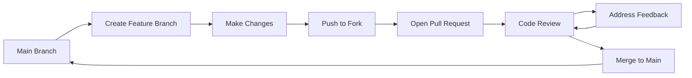

# Contributing to Roadtrip Planner

Thank you for your interest in contributing to Roadtrip Planner! This guide will help you get started with the development process.

## Contribution Policy

We follow a standard GitHub workflow for contributions:

### 1. Fork & Clone

1. Fork the repository on GitHub
2. Clone your fork locally:
   ```bash
   git clone https://github.com/YOUR_USERNAME/roadtrip_planner.git
   cd roadtrip_planner
   ```

### 2. Create a Feature Branch

Create a descriptive branch name for your feature or fix:

```bash
git checkout -b feature/amazing-feature
# or
git checkout -b fix/bug-description
```

### 3. Make Your Changes

- Follow the coding conventions outlined in this documentation
- Write tests for new functionality
- Ensure existing tests pass
- Keep commits focused and atomic
- Write clear, descriptive commit messages

### 4. Test Your Changes

Run the full test suite to ensure your changes don't break existing functionality:

```bash
# Run all tests
docker compose exec web rspec

# Run specific tests
docker compose exec web rspec spec/requests/
docker compose exec web rspec spec/models/

# Run linting
docker compose exec web rubocop
```

### 5. Submit a Pull Request

1. Push your branch to your fork:
   ```bash
   git push origin feature/amazing-feature
   ```

2. Open a Pull Request against the `main` branch
3. Fill out the PR template with:
   - Clear description of changes
   - Link to any related issues
   - Screenshots for UI changes
   - Testing notes

### 6. Review Process

- All PRs require at least one review from a maintainer
- Address any feedback or requested changes
- Once approved, a maintainer will merge your PR

## GitHub Flow

We use a simplified GitHub Flow:



## Code of Conduct

- Be respectful and inclusive
- Provide constructive feedback
- Help newcomers get up to speed
- Keep discussions focused and professional

## Issue Guidelines

When reporting bugs or requesting features:

### Bug Reports

Include:
- Clear description of the issue
- Steps to reproduce
- Expected vs actual behavior
- Environment details (OS, Docker version, etc.)
- Relevant logs or error messages

### Feature Requests

Include:
- Clear description of the proposed feature
- Use cases and motivation
- Any implementation ideas
- Mockups or examples if applicable

## Development Guidelines

### Branch Naming

- `feature/description` - New features
- `fix/description` - Bug fixes  
- `docs/description` - Documentation updates
- `refactor/description` - Code refactoring
- `test/description` - Test improvements

### Commit Messages

Follow conventional commits format:

```
type(scope): description

[optional body]

[optional footer]
```

Examples:
- `feat(auth): add password reset functionality`
- `fix(routes): resolve route overlap validation bug`
- `docs(api): update authentication examples`
- `test(models): add road trip validation specs`

### Code Style

We use RuboCop with Rails Omakase configuration:

```bash
# Check code style
docker compose exec web rubocop

# Auto-fix issues
docker compose exec web rubocop -a
```

### Testing Standards

- Write tests for all new functionality
- Maintain or improve test coverage
- Use descriptive test names
- Follow existing test patterns
- Test both happy path and edge cases

## Getting Help

- Check existing documentation
- Search existing issues
- Ask questions in new issues with the "question" label
- Reach out to maintainers for guidance

## Recognition

Contributors will be recognized in:
- Project README
- Release notes for significant contributions
- GitHub contributors list

Thank you for helping make Roadtrip Planner better! 🚗✨