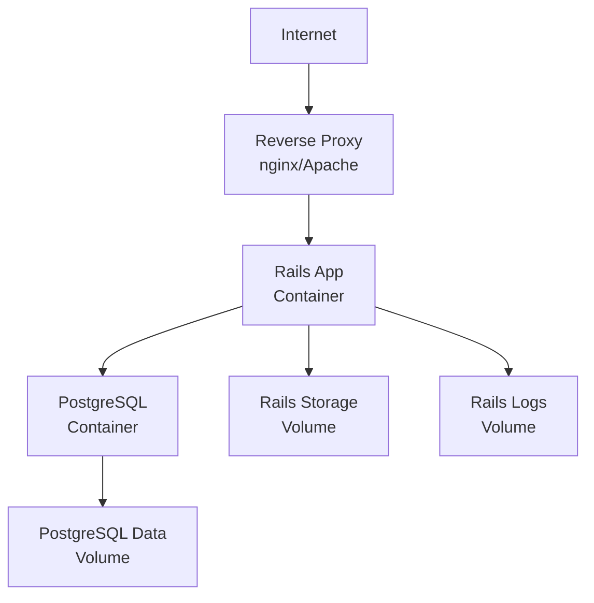

# Deployment

This guide covers how to deploy the Roadtrip Planner application to production environments using Docker.

## Prerequisites

- Docker and Docker Compose installed on your production server
- Access to a Docker registry (Docker Hub, GitHub Container Registry, etc.)
- Basic knowledge of Linux server administration
- Domain name (optional, but recommended)

## Building a New Image Locally

Before deploying, you need to build a Docker image of your application:

### Build the Image

```bash
# Build with latest tag
docker build -t roadtrip_planner:latest .

# Build with specific version tag
docker build -t roadtrip_planner:v1.0.0 .
```

### Push to Docker Registry

To deploy the image to a server, you'll need to push it to a Docker registry:

```bash
# Tag the image for Docker Hub
docker tag roadtrip_planner:latest yourusername/roadtrip_planner:latest

# Push to Docker Hub
docker push yourusername/roadtrip_planner:latest
```

For private registries:
```bash
# Tag for private registry
docker tag roadtrip_planner:latest registry.example.com/roadtrip_planner:latest

# Login to private registry
docker login registry.example.com

# Push to private registry
docker push registry.example.com/roadtrip_planner:latest
```

## Deploying an Existing Image to Production

### 1. Prepare the Production Server

Copy the production Docker Compose file (`docker-compose.production.yml`) to your server. This file includes:

- **Persistent volumes** for data preservation
- **Production-optimized PostgreSQL settings**
- **Health checks** for service orchestration
- **Restart policies** for high availability
- **Environment-based configuration**

### 2. Configure Environment Variables

Create a `.env.production` file on your server:

```bash
# Database Configuration
POSTGRES_DB=roadtrip_planner_production
POSTGRES_USER=roadtrip_planner_prod
POSTGRES_PASSWORD=your_very_secure_password_here

# Rails Configuration
SECRET_KEY_BASE=your_secret_key_base_here
RAILS_MASTER_KEY=your_master_key_here

# Docker Configuration
DOCKER_IMAGE=yourusername/roadtrip_planner:latest
PORT=3000

# Optional: Email Configuration
SMTP_ADDRESS=smtp.example.com
SMTP_PORT=587
SMTP_USER_NAME=your_email@example.com
SMTP_PASSWORD=your_email_password
```

Generate a secure secret key base:
```bash
docker run --rm roadtrip_planner:latest bundle exec rails secret
```

### 3. Initial Deployment

```bash
# Pull the Docker image
docker pull yourusername/roadtrip_planner:latest

# Start the containers
docker compose -f docker-compose.production.yml up -d

# Create and migrate the database
docker compose -f docker-compose.production.yml exec web bundle exec rails db:create
docker compose -f docker-compose.production.yml exec web bundle exec rails db:migrate

# Precompile assets (if not done in Dockerfile)
docker compose -f docker-compose.production.yml exec web bundle exec rails assets:precompile

# Optional: Seed initial data
docker compose -f docker-compose.production.yml exec web bundle exec rails db:seed
```

### 4. Verify Deployment

Check that all services are running:
```bash
docker compose -f docker-compose.production.yml ps
```

View application logs:
```bash
docker compose -f docker-compose.production.yml logs -f web
```

### 5. Access the Application

The application will be available at `http://your-server-ip:3000`

For production, configure a reverse proxy (nginx/Apache) to:
- Serve the application on ports 80/443
- Handle SSL termination
- Add security headers
- Enable compression

## Deploying Updates Without Data Loss

A shell script (`scripts/update-deployment.sh`) is provided for zero-downtime updates.

### Make the Script Executable

```bash
chmod +x scripts/update-deployment.sh
```

### Usage

Update to latest version:
```bash
./scripts/update-deployment.sh
```

Update to specific version:
```bash
./scripts/update-deployment.sh v1.2.0
```

The script will:
1. Prompt for the compose file location
2. Record current deployment state
3. Pull the new Docker image
4. Run database migrations
5. Precompile assets
6. Update containers with zero downtime
7. Verify service health
8. Clean up old images

### What the Script Does

- **Preserves all data** in Docker volumes
- **Runs migrations** before updating containers
- **Prevents updates** if migrations fail
- **Creates backups** of deployment state with timestamps
- **Supports rollback** if issues occur

## Production Architecture



## Volume Management

The production setup uses several Docker volumes:

| Volume | Purpose | Backup Priority |
|--------|---------|-----------------|
| `postgres_data` | Database files | Critical |
| `rails_storage` | Active Storage files | High |
| `rails_logs` | Application logs | Medium |
| `rails_tmp` | Temporary files | Low |

### Backing Up Volumes

```bash
# Backup PostgreSQL data
docker run --rm \
  -v roadtrip_planner_postgres_data:/data \
  -v $(pwd):/backup \
  alpine tar czf /backup/postgres_backup_$(date +%Y%m%d).tar.gz -C /data .

# Backup Rails storage
docker run --rm \
  -v roadtrip_planner_rails_storage:/data \
  -v $(pwd):/backup \
  alpine tar czf /backup/storage_backup_$(date +%Y%m%d).tar.gz -C /data .
```

### Restoring from Backup

```bash
# Stop the application
docker compose -f docker-compose.production.yml down

# Restore PostgreSQL data
docker run --rm \
  -v roadtrip_planner_postgres_data:/data \
  -v $(pwd):/backup \
  alpine tar xzf /backup/postgres_backup_20240101.tar.gz -C /data

# Start the application
docker compose -f docker-compose.production.yml up -d
```

## Monitoring

### Health Checks

The production compose file includes health checks:
```yaml
healthcheck:
  test: ["CMD-SHELL", "pg_isready -U ${POSTGRES_USER} -d ${POSTGRES_DB}"]
  interval: 10s
  timeout: 5s
  retries: 5
```

### Application Monitoring

Monitor key metrics:
```bash
# Container resource usage
docker stats

# Application logs
docker compose -f docker-compose.production.yml logs -f web

# Database logs
docker compose -f docker-compose.production.yml logs -f db

# Rails production log
docker compose -f docker-compose.production.yml exec web tail -f log/production.log
```

## Security Best Practices

1. **Use specific version tags** instead of `latest` for stability
2. **Keep secrets in environment files**, never in code
3. **Regular security updates** for base images
4. **Enable firewall** to restrict access to necessary ports
5. **Use HTTPS** with valid SSL certificates
6. **Regular backups** with offsite storage
7. **Monitor logs** for suspicious activity
8. **Implement rate limiting** at the reverse proxy level

## Troubleshooting Production Issues

### Container Won't Start

```bash
# Check logs
docker compose -f docker-compose.production.yml logs web

# Check container status
docker compose -f docker-compose.production.yml ps

# Verify environment variables
docker compose -f docker-compose.production.yml config
```

### Database Connection Issues

```bash
# Test database connection
docker compose -f docker-compose.production.yml exec db pg_isready

# Access database console
docker compose -f docker-compose.production.yml exec db psql -U $POSTGRES_USER -d $POSTGRES_DB

# Check database logs
docker compose -f docker-compose.production.yml logs db
```

### Performance Issues

```bash
# Check resource usage
docker stats

# Analyze Rails logs
docker compose -f docker-compose.production.yml exec web grep "Completed" log/production.log | tail -100

# Check slow queries
docker compose -f docker-compose.production.yml exec db psql -U $POSTGRES_USER -d $POSTGRES_DB -c "SELECT * FROM pg_stat_statements ORDER BY total_time DESC LIMIT 10;"
```

### Emergency Rollback

If an update causes issues:
```bash
# Stop current containers
docker compose -f docker-compose.production.yml down

# Pull previous version
docker pull yourusername/roadtrip_planner:previous-version

# Update DOCKER_IMAGE in .env.production
echo "DOCKER_IMAGE=yourusername/roadtrip_planner:previous-version" >> .env.production

# Restart with previous version
docker compose -f docker-compose.production.yml up -d
```

## Scaling Considerations

For high-traffic deployments:

1. **Database Replication**: Set up PostgreSQL read replicas
2. **Horizontal Scaling**: Run multiple Rails containers behind a load balancer
3. **Caching**: Implement Redis for Rails caching
4. **CDN**: Use a CDN for static assets
5. **Background Jobs**: Add Sidekiq for async processing

## Continuous Deployment

For automated deployments, consider:
- GitHub Actions for CI/CD
- Webhook-triggered deployments
- Blue-green deployment strategy
- Container orchestration with Kubernetes