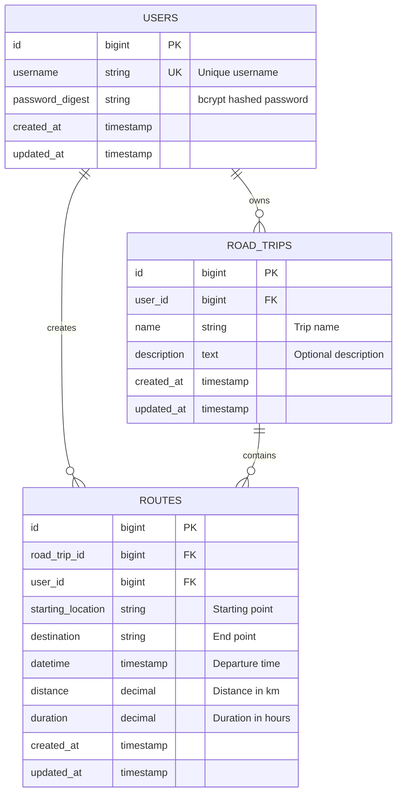

# Models Overview

The Roadtrip Planner application uses a clean, domain-driven model architecture with three core entities that represent the business logic of trip planning.

## Model Architecture



## Core Models

### 1. User Model
**Purpose**: Authentication and user management  
**File**: `app/models/user.rb`

The User model handles authentication and serves as the owner of all trip-related data.

**Key Features**:
- Secure password authentication with bcrypt
- Username-based login system
- Owns all road trips and routes
- Data cleanup on deletion

### 2. RoadTrip Model  
**Purpose**: Trip organization and planning  
**File**: `app/models/road_trip.rb`

The RoadTrip model represents a complete trip plan that can contain multiple routes.

**Key Features**:
- Named trip organization
- Route aggregation and statistics
- User ownership and access control
- Trip duration calculation

### 3. Route Model
**Purpose**: Individual trip segments  
**File**: `app/models/route.rb`

The Route model represents individual legs of a journey with detailed location and timing information.

**Key Features**:
- Location-to-location mapping
- Distance and duration calculation
- Overlap validation for trip planning
- GPX export compatibility

## Model Relationships

### Association Patterns

```ruby
# User associations
class User < ApplicationRecord
  has_many :road_trips, dependent: :destroy
  has_many :routes, dependent: :destroy
end

# RoadTrip associations  
class RoadTrip < ApplicationRecord
  belongs_to :user
  has_many :routes, dependent: :destroy
end

# Route associations
class Route < ApplicationRecord
  belongs_to :road_trip
  belongs_to :user
end
```

### Data Integrity

The model design ensures data integrity through:

1. **Foreign Key Constraints**: All child records reference parent IDs
2. **Dependent Destruction**: Cascading deletes maintain referential integrity
3. **Validation Rules**: Business logic prevents invalid data states
4. **User Ownership**: Double-reference pattern ensures user access control

## Validation Strategy

### Security Validations

```ruby
# User model validations
validates :username, presence: true, 
                    length: { minimum: 3 },
                    uniqueness: { case_sensitive: false }

validates :password, presence: true,
                    length: { minimum: 8 },
                    format: { with: /\A(?=.*[a-zA-Z])(?=.*\d).*\z/ }
```

### Business Logic Validations

```ruby
# Route model business validations
validate :datetime_not_overlapping_with_other_routes
validate :user_matches_road_trip_user
```

## Scopes and Query Patterns

### User-Scoped Data Access

```ruby
# Secure data access patterns
class RoadTrip < ApplicationRecord
  scope :for_user, ->(user) { where(user: user) }
end

class Route < ApplicationRecord
  scope :for_user, ->(user) { where(user: user) }
  scope :ordered_by_datetime, -> { order(:datetime) }
end
```

### Performance Optimization

```ruby
# Efficient data loading
trips_with_routes = RoadTrip.includes(:routes).for_user(user)
recent_trips = RoadTrip.for_user(user).order(created_at: :desc).limit(10)
```

## Business Logic Implementation

### Calculated Fields

Models include business logic for derived data:

```ruby
class RoadTrip < ApplicationRecord
  # Aggregate route distances
  def total_distance
    routes.sum { |route| route.distance_in_km.to_f }.round(1)
  end

  # Calculate trip duration in days
  def day_count
    return 0 if routes.empty?
    # Logic for calculating total trip days
  end
end
```

### Data Processing

```ruby
class Route < ApplicationRecord
  # Automatic distance/duration calculation
  before_save :calculate_route_metrics, if: :locations_changed?
  
  # Safe distance access with fallback
  def distance_in_km
    distance || calculate_and_save_route_metrics[:distance]
  end
end
```

## Model Testing Strategy

### Test Coverage Areas

1. **Validations**: All validation rules tested
2. **Associations**: Relationship behavior verified
3. **Business Logic**: Calculated fields and methods tested
4. **Security**: Access control and data ownership tested

### Example Test Structure

```ruby
RSpec.describe User, type: :model do
  describe 'validations' do
    # Validation tests
  end
  
  describe 'associations' do
    # Association tests
  end
  
  describe 'business logic' do
    # Method and calculation tests
  end
end
```

## Database Schema Considerations

### Index Strategy

```ruby
# Optimized database indexes for common queries
add_index :road_trips, :user_id
add_index :routes, [:road_trip_id, :user_id]
add_index :routes, :datetime
add_index :users, :username, unique: true
```

### Migration Patterns

```ruby
# Safe migration practices
class CreateRoadTrips < ActiveRecord::Migration[8.0]
  def change
    create_table :road_trips do |t|
      t.references :user, null: false, foreign_key: true
      t.string :name, null: false
      t.text :description
      t.timestamps
    end
    
    add_index :road_trips, :user_id
  end
end
```

## Security Considerations

### Access Control

- **User Ownership**: All data belongs to specific users
- **Authorization Checks**: Controllers verify user access
- **Data Isolation**: Scopes prevent cross-user data access

### Input Validation

- **SQL Injection Prevention**: ActiveRecord parameterized queries
- **Data Sanitization**: Strong parameters in controllers
- **Business Rule Enforcement**: Model validations prevent invalid states

## Performance Patterns

### Efficient Queries

```ruby
# Avoid N+1 queries
trips_with_routes = current_user.road_trips.includes(:routes)

# Use database aggregations
total_distance = current_user.routes.sum(:distance)

# Batch operations for efficiency
Route.where(road_trip: trip).update_all(updated_at: Time.current)
```

### Caching Strategy

```ruby
# Model-level caching for expensive calculations
def total_distance
  Rails.cache.fetch("road_trip_#{id}_total_distance", expires_in: 1.hour) do
    routes.sum { |route| route.distance_in_km.to_f }.round(1)
  end
end
```

## Future Enhancements

### Planned Model Extensions

1. **Waypoints**: Intermediate stops within routes
2. **Trip Sharing**: Collaborative trip planning
3. **Trip Templates**: Reusable trip patterns  
4. **Accommodation**: Hotel/lodging integration
5. **Expenses**: Trip cost tracking

### Scalability Considerations

- **Pagination**: Large trip lists with pagination
- **Background Processing**: Distance calculations in jobs
- **API Support**: JSON serialization for mobile apps
- **Caching**: Aggressive caching for read-heavy operations

The model architecture provides a solid foundation for the current trip planning features while maintaining flexibility for future enhancements and scaling needs.