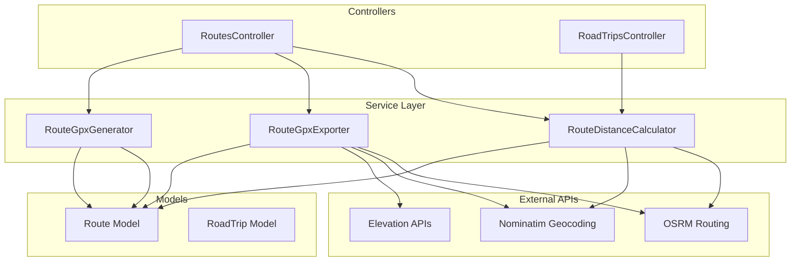

# Services Overview

The Roadtrip Planner application uses service objects to encapsulate business logic, external API integrations, and complex operations. Services follow the Single Responsibility Principle and provide clean, testable interfaces for core functionality.

## Service Architecture



## Available Services

### Core Route Services

<div style="display: grid; grid-template-columns: repeat(auto-fit, minmax(300px, 1fr)); gap: 20px; margin: 20px 0;">

<div style="border: 1px solid #e1e4e8; border-radius: 8px; padding: 16px;">

#### 📍 [RouteDistanceCalculator](./route-distance-calculator)

Calculates driving distances and travel times between locations using geocoding and routing APIs.

**Key Features:**
- Geocoding with Nominatim
- OSRM routing integration
- Fallback calculations
- Response caching

**Common Use Cases:**
- Route planning
- Trip duration estimates
- Distance validation

</div>

<div style="border: 1px solid #e1e4e8; border-radius: 8px; padding: 16px;">

#### 📄 [RouteGpxExporter](./route-gpx-exporter)

Generates standards-compliant GPX 1.1 files with full metadata, elevation data, and device extensions.

**Key Features:**
- GPX 1.1 compliance
- Elevation profiles
- Garmin extensions
- Schema validation

**Common Use Cases:**
- GPS device export
- Professional navigation
- Route archiving

</div>

<div style="border: 1px solid #e1e4e8; border-radius: 8px; padding: 16px;">

#### 🚀 [RouteGpxGenerator](./route-gpx-generator)

Provides lightweight GPX generation for quick sharing and basic navigation needs.

**Key Features:**
- Minimal file size
- Fast generation
- Fallback support
- Mobile optimized

**Common Use Cases:**
- Quick sharing
- Mobile apps
- Preview generation

</div>

</div>

## Service Design Patterns

### Result Object Pattern

All services return structured result objects for consistent error handling:

```ruby
# Standard result structure
{
  data: { ... },      # Service-specific data
  success?: true,     # Success indicator
  error: nil,         # Error message if failed
  metadata: { ... }   # Additional information
}
```

### Dependency Injection

Services accept dependencies through initialization:

```ruby
class RouteService
  def initialize(route, options = {})
    @route = route
    @logger = options[:logger] || Rails.logger
    @cache = options[:cache] || Rails.cache
  end
end
```

### Error Handling Strategy

Services implement graceful degradation with fallbacks:

```ruby
def calculate
  primary_result = fetch_from_api
  return primary_result if primary_result.success?
  
  fallback_result = calculate_fallback
  fallback_result.merge(fallback_used: true)
rescue StandardError => e
  log_error(e)
  error_result(e.message)
end
```

## External API Dependencies

### OpenStreetMap Services

| Service | Purpose | Rate Limit | Documentation |
|---------|---------|------------|---------------|
| **Nominatim** | Geocoding | 1 req/sec | [Docs](https://nominatim.org/release-docs/latest/) |
| **OSRM** | Routing | No limit* | [Docs](http://project-osrm.org/docs/v5.24.0/api/) |
| **Overpass** | POI Data | Variable | [Docs](https://wiki.openstreetmap.org/wiki/Overpass_API) |

*Public instance has fair use policy

### Optional Integrations

Services are designed to work with optional third-party APIs:

- **Elevation**: Open-Elevation, Mapbox
- **Weather**: OpenWeatherMap, WeatherAPI
- **Traffic**: Google Maps, HERE Maps
- **Places**: Google Places, Foursquare

## Creating New Services

### Service Template

```ruby
# app/services/my_new_service.rb
class MyNewService
  def initialize(model, options = {})
    @model = model
    @options = default_options.merge(options)
  end
  
  def perform
    validate_input
    
    result = process_data
    
    format_result(result)
  rescue StandardError => e
    handle_error(e)
  end
  
  private
  
  def default_options
    {
      timeout: 10.seconds,
      retries: 3
    }
  end
  
  def validate_input
    raise ArgumentError, "Model required" unless @model
  end
  
  def format_result(data)
    {
      success?: true,
      data: data,
      timestamp: Time.current
    }
  end
  
  def handle_error(error)
    Rails.logger.error "Service error: #{error.message}"
    
    {
      success?: false,
      error: error.message,
      timestamp: Time.current
    }
  end
end
```

### Testing Services

```ruby
RSpec.describe MyNewService do
  let(:model) { create(:model) }
  let(:service) { described_class.new(model) }
  
  describe '#perform' do
    context 'with valid input' do
      it 'returns successful result' do
        result = service.perform
        
        expect(result[:success?]).to be true
        expect(result[:data]).to be_present
      end
    end
    
    context 'with invalid input' do
      let(:model) { nil }
      
      it 'returns error result' do
        result = service.perform
        
        expect(result[:success?]).to be false
        expect(result[:error]).to be_present
      end
    end
  end
end
```

## Performance Considerations

### Caching Strategy

Services implement multi-level caching:

1. **Request Cache**: Per-request memoization
2. **Application Cache**: Redis/Memory store
3. **HTTP Cache**: ETags and Last-Modified headers

### Async Processing

Long-running services can be executed asynchronously:

```ruby
# Inline execution
RouteDistanceCalculator.new(route).calculate

# Background job
RouteCalculationJob.perform_later(route.id)
```

### Rate Limiting

Services respect API rate limits:

```ruby
class RateLimitedService
  include Throttle
  
  throttle :api_call, limit: 60, period: 1.minute
  
  def fetch_data
    with_throttle(:api_call) do
      # API call here
    end
  end
end
```

## Monitoring and Observability

### Service Metrics

Track service performance with ActiveSupport::Notifications:

```ruby
ActiveSupport::Notifications.instrument('service.perform', 
  service: self.class.name) do |payload|
  
  result = perform_operation
  
  payload[:success] = result[:success?]
  payload[:duration] = Time.current - started_at
  payload[:error] = result[:error]
  
  result
end
```

### Health Checks

Services provide health check endpoints:

```ruby
class ServiceHealth
  def self.check_all
    {
      route_calculator: check_service(RouteDistanceCalculator),
      gpx_exporter: check_service(RouteGpxExporter),
      external_apis: check_external_apis
    }
  end
end
```

## Configuration

### Environment Variables

```bash
# External API Configuration
OSRM_URL=https://router.project-osrm.org
NOMINATIM_URL=https://nominatim.openstreetmap.org
ELEVATION_API_KEY=your_key_here

# Service Configuration
SERVICE_TIMEOUT=10
SERVICE_RETRIES=3
SERVICE_CACHE_TTL=3600
```

### Rails Configuration

```ruby
# config/application.rb
config.services = {
  timeout: 10.seconds,
  cache_ttl: 1.hour,
  rate_limit: 60,
  retry_count: 3
}
```

## Best Practices

1. **Single Responsibility**: Each service should do one thing well
2. **Dependency Injection**: Accept dependencies as parameters
3. **Error Handling**: Always provide graceful fallbacks
4. **Testing**: Mock external dependencies in tests
5. **Documentation**: Document API dependencies and options
6. **Monitoring**: Instrument services for observability
7. **Caching**: Cache expensive operations appropriately

## Future Service Plans

### Planned Services

- **RouteOptimizer**: Multi-stop route optimization
- **WeatherService**: Weather data for trip planning
- **AccommodationFinder**: Hotel/camping search
- **PointsOfInterestService**: Attraction recommendations
- **TrafficAnalyzer**: Real-time traffic integration
- **ExpenseCalculator**: Trip cost estimation

### Architecture Evolution

Future architectural improvements:

- **Service Registry**: Dynamic service discovery
- **Circuit Breakers**: Resilience patterns
- **Event Sourcing**: Audit trail for operations
- **GraphQL Integration**: Flexible API queries

## Quick Reference

| Service | Primary Function | External APIs | Caching |
|---------|-----------------|---------------|---------|
| [RouteDistanceCalculator](./route-distance-calculator) | Distance & time calculation | Nominatim, OSRM | 1 hour |
| [RouteGpxExporter](./route-gpx-exporter) | Full GPX export | Nominatim, OSRM, Elevation | 1 day |
| [RouteGpxGenerator](./route-gpx-generator) | Simple GPX export | None (optional) | 1 hour |

## Getting Help

For questions about services:

1. Check individual service documentation
2. Review service tests for usage examples
3. Consult the [Architecture Overview](../architecture/overview)
4. See [Contributing Guide](../contributing) for development guidelines