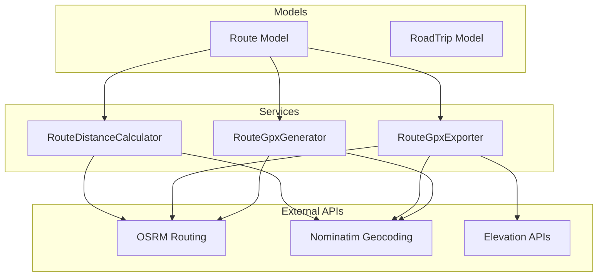

# Services Overview

The Roadtrip Planner application uses service objects to encapsulate business logic, external API integrations, and complex operations. Services follow the Single Responsibility Principle and provide clean, testable interfaces for core functionality.

## Service Architecture



## Core Services

### 1. RouteDistanceCalculator
**Purpose**: Calculate distance and duration between locations  
**File**: `app/services/route_distance_calculator.rb`

**Key Features**:
- Geocoding location strings to coordinates
- OSRM routing API integration for accurate driving routes
- Fallback to straight-line distance calculation
- Error handling and graceful degradation

### 2. RouteGpxExporter
**Purpose**: Export routes to standards-compliant GPX 1.1 format  
**File**: `app/services/route_gpx_exporter.rb`

**Key Features**:
- Full GPX 1.1 specification compliance
- Track points with elevation data
- Waypoints for start/end locations
- Garmin extensions for enhanced GPS data
- Metadata and validation

### 3. RouteGpxGenerator  
**Purpose**: Generate simplified GPX files for route data  
**File**: `app/services/route_gpx_generator.rb`

**Key Features**:
- Lightweight GPX generation
- Route data fetching from OSRM
- Fallback to waypoint-only GPX
- Simplified structure for basic GPS usage

## Service Design Patterns

### Result Object Pattern

Services return structured result objects for consistent error handling:

```ruby
# Example result structure
{
  distance: 150.5,    # kilometers
  duration: 2.5,      # hours
  success?: true,     # boolean
  error: nil          # error message if failed
}
```

### External API Integration

Services handle external API calls with:
- **Timeout handling**: Prevent hanging requests
- **Rate limiting**: Respect API usage limits
- **Graceful fallbacks**: Alternative methods when APIs fail
- **Error logging**: Detailed error tracking

### Caching Strategy

Services implement caching to:
- Reduce external API calls
- Improve response times
- Minimize costs for paid APIs
- Handle offline scenarios

## API Dependencies

### OpenStreetMap Services

**Nominatim Geocoding**:
- **URL**: `https://nominatim.openstreetmap.org/`
- **Purpose**: Convert location strings to coordinates
- **Rate Limit**: 1 request per second
- **Format**: JSON responses with lat/lon coordinates

**OSRM Routing**:
- **URL**: `https://router.project-osrm.org/`
- **Purpose**: Calculate driving routes between coordinates
- **Features**: Distance, duration, turn-by-turn directions
- **Format**: GeoJSON geometry with metadata

### Optional Services

**Elevation APIs** (planned):
- Open-Elevation
- Mapbox Elevation API
- Google Elevation API

## Error Handling Strategy

### Graceful Degradation

```ruby
def calculate
  # Try primary service
  result = fetch_osrm_data
  
  # Fallback to estimation
  result ||= calculate_straight_line_estimate
  
  # Return best available data
  format_result(result)
end
```

### Logging and Monitoring

```ruby
def handle_api_error(error, service_name)
  Rails.logger.error "#{service_name} API error: #{error.message}"
  
  # Optional: Send to monitoring service
  # Sentry.capture_exception(error) if defined?(Sentry)
  
  nil # Return nil to trigger fallback
end
```

## Performance Considerations

### Async Processing

For expensive operations, services support background processing:

```ruby
# In controllers
RouteCalculationJob.perform_later(route.id)

# In jobs
class RouteCalculationJob < ApplicationJob
  def perform(route_id)
    route = Route.find(route_id)
    RouteDistanceCalculator.new(
      route.starting_location,
      route.destination
    ).calculate
  end
end
```

### Caching Implementation

```ruby
# Service-level caching
def calculate_with_cache
  cache_key = "route_calc_#{cache_params}"
  
  Rails.cache.fetch(cache_key, expires_in: 1.hour) do
    calculate_without_cache
  end
end

private

def cache_params
  Digest::MD5.hexdigest("#{@start_location}_#{@end_location}")
end
```

## Testing Strategy

### Service Testing Pattern

```ruby
RSpec.describe RouteDistanceCalculator do
  let(:calculator) { described_class.new("Start", "End") }
  
  describe '#calculate' do
    context 'with successful API response' do
      before do
        # Mock external API calls
        stub_request(:get, /nominatim/)
          .to_return(body: geocoding_response.to_json)
        stub_request(:get, /osrm/)
          .to_return(body: routing_response.to_json)
      end
      
      it 'returns distance and duration' do
        result = calculator.calculate
        expect(result[:distance]).to be_a(Float)
        expect(result[:duration]).to be_a(Float)
      end
    end
    
    context 'with API failure' do
      before do
        stub_request(:get, /osrm/).to_timeout
      end
      
      it 'falls back to straight-line calculation' do
        result = calculator.calculate
        expect(result[:distance]).to be_present
      end
    end
  end
end
```

### Mock External Dependencies

```ruby
# spec/support/api_helpers.rb
module ApiHelpers
  def stub_successful_geocoding(location, lat, lon)
    response = [{
      "lat" => lat.to_s,
      "lon" => lon.to_s,
      "display_name" => location
    }]
    
    stub_request(:get, /nominatim.*#{URI.encode_www_form_component(location)}/)
      .to_return(body: response.to_json)
  end
  
  def stub_successful_routing(distance, duration)
    response = {
      "routes" => [{
        "distance" => distance,
        "duration" => duration,
        "geometry" => {
          "coordinates" => [[0, 0], [1, 1]]
        }
      }]
    }
    
    stub_request(:get, /osrm/)
      .to_return(body: response.to_json)
  end
end
```

## Configuration and Environment

### API Configuration

```ruby
# config/application.rb or initializers
class Application < Rails::Application
  # Service timeouts
  config.route_calculator_timeout = 10.seconds
  config.geocoding_timeout = 5.seconds
  
  # Caching settings
  config.route_cache_duration = 1.hour
  config.geocoding_cache_duration = 1.day
  
  # Rate limiting
  config.api_request_delay = 1.second
  config.max_retries = 3
end
```

### Environment Variables

```bash
# .env file for API keys (when needed)
MAPBOX_API_KEY=your_mapbox_key
GOOGLE_MAPS_API_KEY=your_google_key

# Service URLs (for testing or custom instances)
OSRM_URL=https://custom-osrm.example.com
NOMINATIM_URL=https://custom-nominatim.example.com
```

## Usage Examples

### Basic Service Usage

```ruby
# Calculate route distance
calculator = RouteDistanceCalculator.new(
  "San Francisco, CA",
  "Los Angeles, CA"
)
result = calculator.calculate

if result[:distance]
  puts "Distance: #{result[:distance]} km"
  puts "Duration: #{result[:duration]} hours"
else
  puts "Calculation failed"
end

# Export to GPX
exporter = RouteGpxExporter.new(route)
gpx_content = exporter.generate

File.write("route.gpx", gpx_content)
```

### Controller Integration

```ruby
class RoutesController < ApplicationController
  def calculate_distance
    calculator = RouteDistanceCalculator.new(
      params[:start],
      params[:destination]
    )
    
    result = calculator.calculate
    
    render json: {
      distance: result[:distance],
      duration: result[:duration]
    }
  end
  
  def export_gpx
    route = current_user.routes.find(params[:id])
    exporter = RouteGpxExporter.new(route)
    
    send_data exporter.generate,
      filename: "route_#{route.id}.gpx",
      type: 'application/gpx+xml'
  end
end
```

## Monitoring and Observability

### Service Metrics

Track key metrics for service health:

```ruby
# Custom metrics (using ActiveSupport::Notifications)
ActiveSupport::Notifications.instrument("route_calculation.distance") do |payload|
  payload[:distance] = result[:distance]
  payload[:duration] = calculation_time
  payload[:api_used] = "osrm"
end

# Subscribe to metrics
ActiveSupport::Notifications.subscribe("route_calculation.distance") do |name, start, finish, id, payload|
  Rails.logger.info "Route calculated: #{payload[:distance]}km in #{payload[:duration]}s"
end
```

### Health Checks

```ruby
# Service health check endpoints
class HealthController < ApplicationController
  def services
    checks = {
      osrm: check_osrm_health,
      nominatim: check_nominatim_health,
      overall: true
    }
    
    checks[:overall] = checks.values.all?
    
    render json: checks,
      status: checks[:overall] ? :ok : :service_unavailable
  end
  
  private
  
  def check_osrm_health
    response = Net::HTTP.get_response(URI("https://router.project-osrm.org/"))
    response.code == "400"  # OSRM returns 400 for missing params
  rescue
    false
  end
end
```

## Future Enhancements

### Planned Service Extensions

1. **RouteOptimizer**: Multi-stop route optimization
2. **WeatherService**: Weather data integration
3. **TrafficService**: Real-time traffic updates
4. **MapTileService**: Custom map tile generation
5. **NotificationService**: Email/SMS trip updates

### Service Architecture Evolution

- **Microservices**: Extract services to separate applications
- **API Gateway**: Centralized API management
- **Circuit Breakers**: Improved resilience patterns
- **Event Sourcing**: Audit trail for service operations

The service layer provides a clean separation between business logic and external integrations, ensuring maintainable, testable, and reliable functionality for the core features of the application.