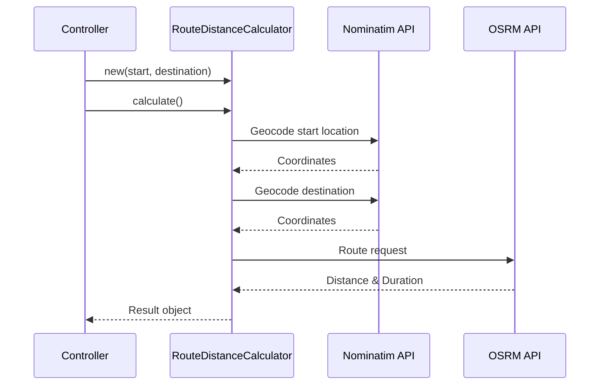

# RouteDistanceCalculator Service

The `RouteDistanceCalculator` service is responsible for calculating driving distances and travel times between locations using external geocoding and routing APIs.

## Overview

**Purpose**: Calculate accurate driving distances and durations between locations  
**File**: `app/services/route_distance_calculator.rb`  
**Primary APIs**: OpenStreetMap Nominatim (geocoding), OSRM (routing)

## Key Features

- 🗺️ **Geocoding**: Convert location strings to geographic coordinates
- 🚗 **Routing**: Calculate actual driving routes via road network
- ⚡ **Fallback**: Graceful degradation to straight-line estimates
- 🔄 **Retry Logic**: Automatic retry on transient failures
- 📊 **Error Handling**: Comprehensive error tracking and logging

## Architecture



## Usage

### Basic Usage

```ruby
# Create calculator instance
calculator = RouteDistanceCalculator.new(
  "San Francisco, CA",
  "Los Angeles, CA"
)

# Calculate distance and duration
result = calculator.calculate

# Access results
if result[:distance]
  puts "Distance: #{result[:distance]} km"
  puts "Duration: #{result[:duration]} hours"
else
  puts "Calculation failed: #{result[:error]}"
end
```

### Controller Integration

```ruby
class RoutesController < ApplicationController
  def calculate_distance
    calculator = RouteDistanceCalculator.new(
      params[:start],
      params[:destination]
    )
    
    result = calculator.calculate
    
    if result[:distance]
      render json: {
        distance: result[:distance],
        duration: result[:duration],
        status: 'success'
      }
    else
      render json: {
        error: result[:error],
        status: 'failed'
      }, status: :unprocessable_entity
    end
  end
end
```

### With Error Handling

```ruby
def calculate_route_details(route)
  calculator = RouteDistanceCalculator.new(
    route.starting_location,
    route.destination
  )
  
  result = calculator.calculate
  
  if result[:distance]
    route.update!(
      distance_km: result[:distance],
      duration_hours: result[:duration],
      calculated_at: Time.current
    )
  else
    Rails.logger.error "Route calculation failed: #{result[:error]}"
    # Handle fallback scenario
  end
rescue StandardError => e
  Rails.logger.error "Unexpected error: #{e.message}"
  raise
end
```

## API Integration

### Nominatim Geocoding

The service uses OpenStreetMap's Nominatim API for geocoding:

```ruby
def geocode_location(location)
  response = Net::HTTP.get_response(
    URI("https://nominatim.openstreetmap.org/search?q=#{URI.encode_www_form_component(location)}&format=json&limit=1")
  )
  
  return nil unless response.code == '200'
  
  data = JSON.parse(response.body).first
  [data['lat'].to_f, data['lon'].to_f] if data
rescue StandardError => e
  Rails.logger.error "Geocoding failed: #{e.message}"
  nil
end
```

**API Details**:
- **Base URL**: `https://nominatim.openstreetmap.org/`
- **Rate Limit**: 1 request per second
- **Format**: JSON
- **Required Headers**: User-Agent string

### OSRM Routing

The service uses OSRM for routing calculations:

```ruby
def fetch_route_data(start_coords, end_coords)
  url = "https://router.project-osrm.org/route/v1/driving/#{start_coords[1]},#{start_coords[0]};#{end_coords[1]},#{end_coords[0]}?overview=full&geometries=geojson"
  
  response = Net::HTTP.get_response(URI(url))
  
  return nil unless response.code == '200'
  
  data = JSON.parse(response.body)
  
  if data['routes']&.first
    route = data['routes'].first
    {
      distance: route['distance'] / 1000.0,  # Convert to km
      duration: route['duration'] / 3600.0,  # Convert to hours
      geometry: route['geometry']
    }
  end
rescue StandardError => e
  Rails.logger.error "Routing failed: #{e.message}"
  nil
end
```

**API Details**:
- **Base URL**: `https://router.project-osrm.org/`
- **Profiles**: driving, cycling, walking
- **Response**: GeoJSON with route geometry
- **No authentication required**

## Fallback Strategy

When APIs fail, the service falls back to straight-line calculations:

```ruby
def calculate_straight_line_distance(start_coords, end_coords)
  # Haversine formula for great-circle distance
  rad_per_deg = Math::PI / 180
  earth_radius_km = 6371
  
  lat1_rad = start_coords[0] * rad_per_deg
  lat2_rad = end_coords[0] * rad_per_deg
  lon1_rad = start_coords[1] * rad_per_deg
  lon2_rad = end_coords[1] * rad_per_deg
  
  a = Math.sin((lat2_rad - lat1_rad) / 2)**2 + 
      Math.cos(lat1_rad) * Math.cos(lat2_rad) * 
      Math.sin((lon2_rad - lon1_rad) / 2)**2
  
  c = 2 * Math.atan2(Math.sqrt(a), Math.sqrt(1 - a))
  
  distance = earth_radius_km * c
  
  # Estimate duration based on average speed
  average_speed_kmh = 80
  duration = distance / average_speed_kmh
  
  {
    distance: distance * 1.4,  # Add 40% for road curvature
    duration: duration,
    method: 'straight_line_estimate'
  }
end
```

## Performance Optimization

### Caching Implementation

```ruby
class RouteDistanceCalculator
  def calculate_with_cache
    cache_key = generate_cache_key
    
    Rails.cache.fetch(cache_key, expires_in: 1.hour) do
      calculate_without_cache
    end
  end
  
  private
  
  def generate_cache_key
    normalized_start = @start_location.downcase.strip
    normalized_end = @end_location.downcase.strip
    
    "route_calc:#{Digest::MD5.hexdigest("#{normalized_start}_#{normalized_end}")}"
  end
end
```

### Batch Processing

For multiple calculations:

```ruby
class BatchRouteCalculator
  def self.calculate_multiple(location_pairs)
    results = []
    
    location_pairs.each_slice(10) do |batch|
      threads = batch.map do |start, destination|
        Thread.new do
          calculator = RouteDistanceCalculator.new(start, destination)
          calculator.calculate
        end
      end
      
      results.concat(threads.map(&:value))
      
      # Respect rate limits
      sleep 1
    end
    
    results
  end
end
```

## Testing

### Unit Tests

```ruby
RSpec.describe RouteDistanceCalculator do
  let(:calculator) { described_class.new("New York, NY", "Boston, MA") }
  
  describe '#calculate' do
    context 'with successful API responses' do
      before do
        # Mock geocoding responses
        stub_request(:get, /nominatim.*New York/)
          .to_return(body: [{ lat: "40.7128", lon: "-74.0060" }].to_json)
          
        stub_request(:get, /nominatim.*Boston/)
          .to_return(body: [{ lat: "42.3601", lon: "-71.0589" }].to_json)
          
        # Mock routing response
        stub_request(:get, /osrm/)
          .to_return(body: {
            routes: [{
              distance: 346000,
              duration: 14400
            }]
          }.to_json)
      end
      
      it 'returns distance in kilometers' do
        result = calculator.calculate
        expect(result[:distance]).to be_within(10).of(346)
      end
      
      it 'returns duration in hours' do
        result = calculator.calculate
        expect(result[:duration]).to be_within(0.5).of(4)
      end
    end
    
    context 'with API failures' do
      before do
        stub_request(:get, /nominatim/).to_timeout
      end
      
      it 'falls back to estimation' do
        result = calculator.calculate
        expect(result[:method]).to eq('straight_line_estimate')
        expect(result[:distance]).to be_present
      end
    end
  end
end
```

### Integration Tests

```ruby
RSpec.describe 'Route Distance Calculation', type: :request do
  describe 'POST /routes/calculate_distance' do
    it 'calculates distance between cities' do
      post calculate_distance_routes_path, params: {
        start: 'San Francisco, CA',
        destination: 'Los Angeles, CA'
      }
      
      expect(response).to have_http_status(:ok)
      
      json = JSON.parse(response.body)
      expect(json['distance']).to be_a(Numeric)
      expect(json['duration']).to be_a(Numeric)
    end
  end
end
```

## Configuration

### Timeout Settings

```ruby
# config/initializers/route_calculator.rb
Rails.application.config.route_calculator = {
  geocoding_timeout: 5.seconds,
  routing_timeout: 10.seconds,
  max_retries: 3,
  retry_delay: 1.second
}
```

### Environment Variables

```bash
# .env
OSRM_URL=https://router.project-osrm.org  # Or custom instance
NOMINATIM_URL=https://nominatim.openstreetmap.org
ROUTE_CALC_CACHE_TTL=3600  # Cache duration in seconds
```

## Error Handling

### Common Errors and Solutions

| Error | Cause | Solution |
|-------|-------|----------|
| `Geocoding failed` | Invalid location string | Validate input format |
| `Timeout::Error` | Slow API response | Increase timeout or use fallback |
| `Net::HTTPTooManyRequests` | Rate limit exceeded | Implement request throttling |
| `JSON::ParserError` | Malformed API response | Add response validation |

### Error Recovery Pattern

```ruby
class RouteDistanceCalculator
  def calculate_with_recovery
    retries = 0
    
    begin
      calculate
    rescue Net::OpenTimeout, Net::ReadTimeout => e
      retries += 1
      
      if retries < 3
        sleep(retries * 2)  # Exponential backoff
        retry
      else
        Rails.logger.error "Max retries exceeded: #{e.message}"
        fallback_calculation
      end
    end
  end
end
```

## Monitoring

### Metrics Collection

```ruby
# Track calculation performance
ActiveSupport::Notifications.instrument('route_calculation.complete') do |payload|
  start_time = Time.current
  result = calculator.calculate
  
  payload[:duration] = Time.current - start_time
  payload[:distance] = result[:distance]
  payload[:method] = result[:method] || 'osrm'
  payload[:success] = result[:distance].present?
end
```

### Health Checks

```ruby
class ServiceHealthCheck
  def self.check_route_calculator
    calculator = RouteDistanceCalculator.new(
      "New York, NY",
      "New York, NY"
    )
    
    result = calculator.calculate
    
    {
      service: 'RouteDistanceCalculator',
      status: result[:distance] ? 'healthy' : 'unhealthy',
      response_time: result[:calculation_time],
      last_checked: Time.current
    }
  end
end
```

## Best Practices

1. **Always validate input** before making API calls
2. **Implement caching** for frequently requested routes
3. **Use connection pooling** for high-volume scenarios
4. **Log all API failures** for debugging
5. **Provide meaningful fallbacks** for better UX
6. **Monitor API usage** to avoid rate limits
7. **Test with mocked responses** to avoid API dependencies

## See Also

- [Services Overview](./overview)
- [RouteGpxExporter](./route-gpx-exporter)
- [RouteGpxGenerator](./route-gpx-generator)
- [Route Model](../models/route)