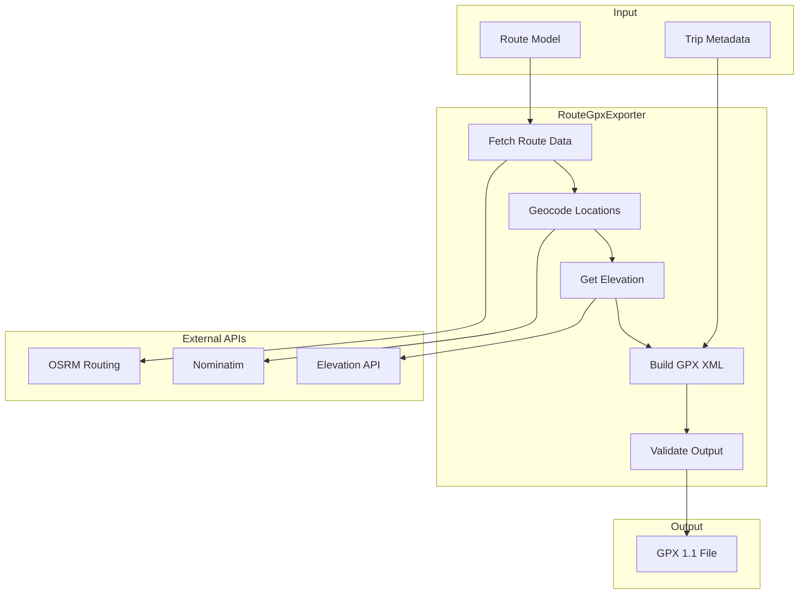

# RouteGpxExporter Service

The `RouteGpxExporter` service generates standards-compliant GPX 1.1 files for route data, enabling export to GPS devices and mapping applications.

## Overview

**Purpose**: Export routes to GPX 1.1 format with full metadata and extensions  
**File**: `app/services/route_gpx_exporter.rb`  
**Standard**: GPX 1.1 with Garmin extensions

## Key Features

- 📍 **Full GPX 1.1 Compliance**: Validates against official XSD schema
- 🏔️ **Elevation Data**: Includes elevation profiles when available  
- 🗺️ **Track Points**: Detailed route geometry with coordinates
- 📌 **Waypoints**: Start, end, and intermediate points of interest
- 🔧 **Garmin Extensions**: Enhanced GPS device compatibility
- ✅ **Validation**: Ensures output meets GPX standards

## Architecture



## Usage

### Basic Export

```ruby
# Export a route to GPX
route = Route.find(params[:id])
exporter = RouteGpxExporter.new(route)

gpx_content = exporter.generate

# Save to file
File.write("route_#{route.id}.gpx", gpx_content)

# Or send to user
send_data gpx_content,
  filename: "route_#{route.id}.gpx",
  type: 'application/gpx+xml',
  disposition: 'attachment'
```

### With Custom Options

```ruby
exporter = RouteGpxExporter.new(route,
  include_elevation: true,
  include_timestamps: true,
  include_extensions: true,
  simplify_track: false
)

gpx_content = exporter.generate
```

### Controller Implementation

```ruby
class RoutesController < ApplicationController
  def export_gpx
    @route = current_user.routes.find(params[:id])
    
    respond_to do |format|
      format.gpx do
        exporter = RouteGpxExporter.new(@route)
        
        send_data exporter.generate,
          filename: "#{@route.name.parameterize}_#{Date.current}.gpx",
          type: 'application/gpx+xml',
          disposition: 'attachment'
      end
    end
  rescue StandardError => e
    Rails.logger.error "GPX export failed: #{e.message}"
    redirect_to @route, alert: 'Export failed. Please try again.'
  end
end
```

## GPX Structure

### Generated GPX Format

```xml
<?xml version="1.0" encoding="UTF-8"?>
<gpx version="1.1" 
     creator="Roadtrip Planner"
     xmlns="http://www.topografix.com/GPX/1/1"
     xmlns:xsi="http://www.w3.org/2001/XMLSchema-instance"
     xmlns:gpxx="http://www.garmin.com/xmlschemas/GpxExtensions/v3"
     xsi:schemaLocation="http://www.topografix.com/GPX/1/1 
                         http://www.topografix.com/GPX/1/1/gpx.xsd">
  
  <!-- Metadata -->
  <metadata>
    <name>San Francisco to Los Angeles</name>
    <desc>Scenic coastal route via Highway 1</desc>
    <author>
      <name>Roadtrip Planner</name>
      <link href="https://roadtripplanner.example.com"/>
    </author>
    <time>2024-03-15T10:30:00Z</time>
    <bounds minlat="34.0522" minlon="-118.2437" 
            maxlat="37.7749" maxlon="-122.4194"/>
  </metadata>
  
  <!-- Waypoints -->
  <wpt lat="37.7749" lon="-122.4194">
    <ele>16.0</ele>
    <name>Start: San Francisco</name>
    <desc>Trip starting point</desc>
    <sym>Flag, Blue</sym>
  </wpt>
  
  <wpt lat="34.0522" lon="-118.2437">
    <ele>89.0</ele>
    <name>End: Los Angeles</name>
    <desc>Trip destination</desc>
    <sym>Flag, Green</sym>
  </wpt>
  
  <!-- Track -->
  <trk>
    <name>Driving Route</name>
    <desc>Generated route with turn-by-turn navigation</desc>
    <trkseg>
      <trkpt lat="37.7749" lon="-122.4194">
        <ele>16.0</ele>
        <time>2024-03-15T10:30:00Z</time>
      </trkpt>
      <!-- Additional track points -->
    </trkseg>
  </trk>
</gpx>
```

### XML Building Implementation

```ruby
class RouteGpxExporter
  def build_gpx_xml
    builder = Nokogiri::XML::Builder.new(encoding: 'UTF-8') do |xml|
      xml.gpx(gpx_attributes) do
        add_metadata(xml)
        add_waypoints(xml)
        add_track(xml)
      end
    end
    
    builder.to_xml
  end
  
  private
  
  def gpx_attributes
    {
      'version' => '1.1',
      'creator' => 'Roadtrip Planner',
      'xmlns' => 'http://www.topografix.com/GPX/1/1',
      'xmlns:xsi' => 'http://www.w3.org/2001/XMLSchema-instance',
      'xmlns:gpxx' => 'http://www.garmin.com/xmlschemas/GpxExtensions/v3',
      'xsi:schemaLocation' => gpx_schema_location
    }
  end
  
  def add_metadata(xml)
    xml.metadata do
      xml.name @route.name
      xml.desc @route.description
      xml.author do
        xml.name 'Roadtrip Planner'
        xml.link(href: root_url)
      end
      xml.time Time.current.iso8601
      add_bounds(xml)
    end
  end
end
```

## Elevation Integration

### Fetching Elevation Data

```ruby
def fetch_elevation_data(coordinates)
  # Using Open-Elevation API
  locations = coordinates.map { |lat, lon| "#{lat},#{lon}" }.join('|')
  
  response = Net::HTTP.post_form(
    URI('https://api.open-elevation.com/api/v1/lookup'),
    'locations' => locations
  )
  
  if response.code == '200'
    data = JSON.parse(response.body)
    data['results'].map { |r| r['elevation'] }
  else
    # Return nil elevations if API fails
    Array.new(coordinates.size, nil)
  end
rescue StandardError => e
  Rails.logger.error "Elevation fetch failed: #{e.message}"
  Array.new(coordinates.size, nil)
end
```

### Adding Elevation to Track Points

```ruby
def add_track_with_elevation(xml, route_geometry, elevations)
  xml.trk do
    xml.name @route.name
    xml.desc "Route from #{@route.starting_location} to #{@route.destination}"
    
    xml.trkseg do
      route_geometry.zip(elevations).each do |coord, elevation|
        xml.trkpt(lat: coord[1], lon: coord[0]) do
          xml.ele elevation if elevation
          xml.time Time.current.iso8601 if @include_timestamps
        end
      end
    end
  end
end
```

## Garmin Extensions

### Adding Device-Specific Extensions

```ruby
def add_garmin_extensions(xml, track_point)
  xml['gpxx'].TrackPointExtension do
    xml['gpxx'].DisplayColor 'Blue'
    xml['gpxx'].RoutePointExtension do
      xml['gpxx'].rpt(lat: track_point[:lat], lon: track_point[:lon])
    end
  end
end
```

### Route Extensions

```ruby
def add_route_extensions(xml)
  xml.extensions do
    xml['gpxx'].RouteExtension do
      xml['gpxx'].IsAutoNamed false
      xml['gpxx'].DisplayColor 'Blue'
      xml['gpxx'].Width 5
    end
  end
end
```

## Validation

### GPX Schema Validation

```ruby
class GpxValidator
  GPX_SCHEMA_PATH = Rails.root.join('lib', 'schemas', 'gpx_1_1.xsd')
  
  def self.validate(gpx_content)
    doc = Nokogiri::XML(gpx_content)
    schema = Nokogiri::XML::Schema(File.read(GPX_SCHEMA_PATH))
    
    errors = schema.validate(doc)
    
    if errors.empty?
      { valid: true }
    else
      { 
        valid: false, 
        errors: errors.map(&:message) 
      }
    end
  rescue StandardError => e
    { 
      valid: false, 
      errors: ["Validation failed: #{e.message}"] 
    }
  end
end
```

### Pre-export Validation

```ruby
def validate_before_export
  errors = []
  
  errors << "Route must have a starting location" if @route.starting_location.blank?
  errors << "Route must have a destination" if @route.destination.blank?
  errors << "Route must have coordinates" unless route_has_coordinates?
  
  raise ExportError, errors.join(', ') if errors.any?
end
```

## Performance Optimization

### Caching GPX Output

```ruby
class RouteGpxExporter
  def generate_with_cache
    cache_key = "gpx_export:route_#{@route.id}:#{@route.updated_at.to_i}"
    
    Rails.cache.fetch(cache_key, expires_in: 1.day) do
      generate_without_cache
    end
  end
end
```

### Track Simplification

```ruby
def simplify_track(coordinates, tolerance = 0.0001)
  # Douglas-Peucker algorithm for reducing track points
  return coordinates if coordinates.size <= 2
  
  # Find point with maximum distance
  max_distance = 0
  index = 0
  
  (1...coordinates.size - 1).each do |i|
    distance = perpendicular_distance(
      coordinates[i], 
      coordinates.first, 
      coordinates.last
    )
    
    if distance > max_distance
      max_distance = distance
      index = i
    end
  end
  
  # Recursively simplify
  if max_distance > tolerance
    left = simplify_track(coordinates[0..index], tolerance)
    right = simplify_track(coordinates[index..-1], tolerance)
    
    left[0...-1] + right
  else
    [coordinates.first, coordinates.last]
  end
end
```

## Testing

### Unit Tests

```ruby
RSpec.describe RouteGpxExporter do
  let(:route) { create(:route, 
    starting_location: "San Francisco, CA",
    destination: "Los Angeles, CA"
  )}
  let(:exporter) { described_class.new(route) }
  
  describe '#generate' do
    it 'generates valid GPX XML' do
      gpx_content = exporter.generate
      
      doc = Nokogiri::XML(gpx_content)
      expect(doc.errors).to be_empty
      expect(doc.root.name).to eq('gpx')
      expect(doc.root['version']).to eq('1.1')
    end
    
    it 'includes waypoints for start and end' do
      gpx_content = exporter.generate
      doc = Nokogiri::XML(gpx_content)
      
      waypoints = doc.xpath('//xmlns:wpt', 
        'xmlns' => 'http://www.topografix.com/GPX/1/1')
      
      expect(waypoints.size).to eq(2)
    end
    
    it 'includes track with route geometry' do
      gpx_content = exporter.generate
      doc = Nokogiri::XML(gpx_content)
      
      track_points = doc.xpath('//xmlns:trkpt',
        'xmlns' => 'http://www.topografix.com/GPX/1/1')
      
      expect(track_points).not_to be_empty
    end
  end
  
  describe 'elevation data' do
    it 'includes elevation when available' do
      allow(exporter).to receive(:fetch_elevation_data)
        .and_return([100.5, 150.2, 125.8])
      
      gpx_content = exporter.generate
      doc = Nokogiri::XML(gpx_content)
      
      elevations = doc.xpath('//xmlns:ele',
        'xmlns' => 'http://www.topografix.com/GPX/1/1')
      
      expect(elevations).not_to be_empty
    end
  end
end
```

### Integration Tests

```ruby
RSpec.describe 'GPX Export', type: :request do
  let(:user) { create(:user) }
  let(:route) { create(:route, user: user) }
  
  before { sign_in user }
  
  describe 'GET /routes/:id/export.gpx' do
    it 'exports route as GPX file' do
      get route_path(route, format: :gpx)
      
      expect(response).to have_http_status(:ok)
      expect(response.content_type).to include('application/gpx+xml')
      expect(response.headers['Content-Disposition'])
        .to include('attachment')
      
      # Validate GPX content
      doc = Nokogiri::XML(response.body)
      expect(doc.errors).to be_empty
    end
  end
end
```

## Error Handling

### Common Export Errors

| Error | Cause | Solution |
|-------|-------|----------|
| `Missing coordinates` | Route not calculated | Calculate route first |
| `Invalid XML characters` | Special chars in route name | Sanitize input |
| `Elevation API timeout` | Slow external service | Skip elevation data |
| `Memory exceeded` | Very long route | Implement streaming |

### Error Recovery

```ruby
class RouteGpxExporter
  def generate
    validate_before_export
    
    gpx_content = build_gpx_xml
    
    # Validate output
    validation = GpxValidator.validate(gpx_content)
    
    unless validation[:valid]
      Rails.logger.error "Invalid GPX: #{validation[:errors]}"
      return generate_fallback_gpx
    end
    
    gpx_content
  rescue StandardError => e
    Rails.logger.error "GPX generation failed: #{e.message}"
    generate_fallback_gpx
  end
  
  private
  
  def generate_fallback_gpx
    # Minimal valid GPX with just waypoints
    builder = Nokogiri::XML::Builder.new(encoding: 'UTF-8') do |xml|
      xml.gpx(version: '1.1', creator: 'Roadtrip Planner') do
        add_minimal_waypoints(xml)
      end
    end
    
    builder.to_xml
  end
end
```

## Configuration

### Export Settings

```ruby
# config/initializers/gpx_export.rb
Rails.application.config.gpx_export = {
  include_elevation: true,
  include_timestamps: false,
  include_extensions: true,
  simplify_threshold: 0.0001,
  max_track_points: 10000,
  elevation_api_timeout: 5.seconds
}
```

### MIME Type Registration

```ruby
# config/initializers/mime_types.rb
Mime::Type.register "application/gpx+xml", :gpx
```

## Best Practices

1. **Validate route data** before attempting export
2. **Cache generated GPX** for unchanged routes
3. **Simplify long tracks** to reduce file size
4. **Handle API failures gracefully** with fallbacks
5. **Test with real GPS devices** for compatibility
6. **Include meaningful metadata** for user reference
7. **Sanitize user input** to prevent XML injection

## See Also

- [Services Overview](./overview)
- [RouteDistanceCalculator](./route-distance-calculator)
- [RouteGpxGenerator](./route-gpx-generator)
- [Route Model](../models/route)