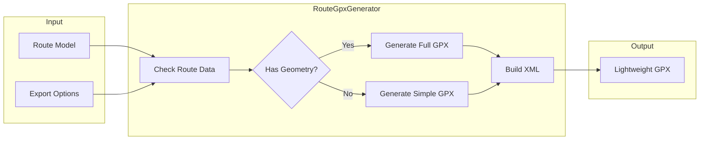

# RouteGpxGenerator Service

The `RouteGpxGenerator` service provides lightweight GPX file generation for basic route export needs, offering a simpler alternative to the full-featured `RouteGpxExporter`.

## Overview

**Purpose**: Generate simplified GPX files for quick route sharing  
**File**: `app/services/route_gpx_generator.rb`  
**Use Case**: Basic GPS navigation without advanced features

## Key Features

- 🚀 **Lightweight**: Minimal GPX structure for faster generation
- 📍 **Waypoint Focus**: Emphasizes key navigation points
- 🔄 **Fallback Ready**: Works even with limited route data
- ⚡ **Fast Generation**: No external API dependencies for basic mode
- 📱 **Mobile Friendly**: Optimized file size for mobile devices

## Architecture



## Comparison with RouteGpxExporter

| Feature | RouteGpxGenerator | RouteGpxExporter |
|---------|-------------------|------------------|
| **File Size** | Small (~5-50 KB) | Large (~50-500 KB) |
| **Generation Speed** | Fast (<100ms) | Slower (~500ms-2s) |
| **Elevation Data** | No | Yes |
| **Garmin Extensions** | No | Yes |
| **Track Points** | Limited | Full resolution |
| **Metadata** | Basic | Comprehensive |
| **Best For** | Quick sharing | Professional GPS |

## Usage

### Basic Generation

```ruby
# Generate simple GPX
route = Route.find(params[:id])
generator = RouteGpxGenerator.new(route)

gpx_content = generator.generate

# Output is immediately ready
File.write("simple_route.gpx", gpx_content)
```

### With Options

```ruby
generator = RouteGpxGenerator.new(route,
  include_track: true,      # Include track points if available
  max_waypoints: 10,        # Limit waypoint count
  simplify: true            # Reduce track complexity
)

gpx_content = generator.generate
```

### Controller Implementation

```ruby
class RoutesController < ApplicationController
  def quick_export
    @route = current_user.routes.find(params[:id])
    
    generator = RouteGpxGenerator.new(@route)
    
    send_data generator.generate,
      filename: "route_#{@route.id}_quick.gpx",
      type: 'application/gpx+xml',
      disposition: 'inline'  # Display in browser
  end
  
  def download_simple_gpx
    @route = current_user.routes.find(params[:id])
    
    # Use generator for lightweight files
    if @route.distance_km.to_f < 100
      generator = RouteGpxGenerator.new(@route)
      gpx = generator.generate
    else
      # Use full exporter for long routes
      exporter = RouteGpxExporter.new(@route)
      gpx = exporter.generate
    end
    
    send_data gpx,
      filename: "#{@route.name.parameterize}.gpx",
      type: 'application/gpx+xml'
  end
end
```

## Implementation Details

### Core Generation Logic

```ruby
class RouteGpxGenerator
  def initialize(route, options = {})
    @route = route
    @options = default_options.merge(options)
  end
  
  def generate
    if route_has_geometry?
      generate_with_track
    else
      generate_waypoints_only
    end
  end
  
  private
  
  def default_options
    {
      include_track: true,
      max_waypoints: 25,
      simplify: true,
      include_time: false
    }
  end
  
  def route_has_geometry?
    @route.geometry.present? || fetch_route_geometry.present?
  end
end
```

### Simple GPX Structure

```ruby
def generate_waypoints_only
  builder = Nokogiri::XML::Builder.new(encoding: 'UTF-8') do |xml|
    xml.gpx(version: '1.1', creator: 'Roadtrip Planner') do
      # Minimal metadata
      xml.metadata do
        xml.name @route.name || "Route #{@route.id}"
        xml.time Time.current.iso8601
      end
      
      # Start waypoint
      add_waypoint(xml, 
        @route.start_coordinates,
        "Start: #{@route.starting_location}",
        'Flag, Blue'
      )
      
      # End waypoint
      add_waypoint(xml,
        @route.end_coordinates,
        "End: #{@route.destination}",
        'Flag, Green'
      )
      
      # Optional intermediate waypoints
      add_intermediate_waypoints(xml) if @options[:include_intermediates]
    end
  end
  
  builder.to_xml
end

def add_waypoint(xml, coordinates, name, symbol = nil)
  return unless coordinates
  
  xml.wpt(lat: coordinates[0], lon: coordinates[1]) do
    xml.name name
    xml.sym symbol if symbol
  end
end
```

### Track Generation

```ruby
def generate_with_track
  geometry = fetch_route_geometry
  
  builder = Nokogiri::XML::Builder.new(encoding: 'UTF-8') do |xml|
    xml.gpx(version: '1.1', creator: 'Roadtrip Planner') do
      add_metadata(xml)
      add_waypoints(xml)
      
      if @options[:include_track] && geometry
        add_simplified_track(xml, geometry)
      end
    end
  end
  
  builder.to_xml
end

def add_simplified_track(xml, geometry)
  points = simplify_geometry(geometry) if @options[:simplify]
  points ||= geometry
  
  xml.trk do
    xml.name @route.name
    xml.trkseg do
      points.each do |point|
        xml.trkpt(lat: point[1], lon: point[0])
      end
    end
  end
end
```

### Geometry Simplification

```ruby
def simplify_geometry(coordinates)
  return coordinates if coordinates.size <= @options[:max_waypoints]
  
  # Simple decimation - keep every Nth point
  step = coordinates.size / @options[:max_waypoints].to_f
  
  simplified = []
  index = 0
  
  while index < coordinates.size - 1
    simplified << coordinates[index.round]
    index += step
  end
  
  # Always include last point
  simplified << coordinates.last
  
  simplified.uniq
end
```

## Fallback Strategies

### When Route Data is Missing

```ruby
def generate_fallback_gpx
  builder = Nokogiri::XML::Builder.new(encoding: 'UTF-8') do |xml|
    xml.gpx(version: '1.1', creator: 'Roadtrip Planner') do
      xml.metadata do
        xml.name "Route: #{@route.starting_location} to #{@route.destination}"
        xml.desc "Route details unavailable - waypoints only"
      end
      
      # Try to geocode and add waypoints
      if start_coords = geocode_location(@route.starting_location)
        add_waypoint(xml, start_coords, @route.starting_location, 'Flag, Blue')
      end
      
      if end_coords = geocode_location(@route.destination)  
        add_waypoint(xml, end_coords, @route.destination, 'Flag, Green')
      end
    end
  end
  
  builder.to_xml
end
```

### Geocoding Fallback

```ruby
def geocode_location(location)
  return nil if location.blank?
  
  # Try to extract coordinates from location string
  if match = location.match(/(-?\d+\.?\d*),\s*(-?\d+\.?\d*)/)
    [match[1].to_f, match[2].to_f]
  else
    # Attempt basic geocoding
    fetch_coordinates_from_cache(location)
  end
rescue
  nil
end
```

## Performance Optimization

### Caching Strategy

```ruby
class RouteGpxGenerator
  def generate_with_cache
    return generate unless @options[:use_cache]
    
    cache_key = "gpx_simple:#{@route.id}:#{@route.updated_at.to_i}"
    
    Rails.cache.fetch(cache_key, expires_in: 1.hour) do
      generate
    end
  end
end
```

### Batch Generation

```ruby
class BulkGpxGenerator
  def self.generate_multiple(routes)
    routes.map do |route|
      generator = RouteGpxGenerator.new(route, 
        include_track: false,  # Faster without tracks
        simplify: true
      )
      
      {
        route_id: route.id,
        filename: "route_#{route.id}.gpx",
        content: generator.generate
      }
    end
  end
  
  def self.create_archive(routes)
    require 'zip'
    
    files = generate_multiple(routes)
    
    Zip::OutputStream.write_buffer do |zipfile|
      files.each do |file|
        zipfile.put_next_entry(file[:filename])
        zipfile.write(file[:content])
      end
    end.string
  end
end
```

## Testing

### Unit Tests

```ruby
RSpec.describe RouteGpxGenerator do
  let(:route) { create(:route) }
  let(:generator) { described_class.new(route) }
  
  describe '#generate' do
    context 'with minimal route data' do
      it 'generates valid GPX with waypoints only' do
        gpx = generator.generate
        doc = Nokogiri::XML(gpx)
        
        expect(doc.errors).to be_empty
        expect(doc.xpath('//xmlns:wpt').size).to be >= 2
      end
    end
    
    context 'with geometry data' do
      before do
        route.update(geometry: [[0,0], [1,1], [2,2]])
      end
      
      it 'includes track points' do
        gpx = generator.generate
        doc = Nokogiri::XML(gpx)
        
        track_points = doc.xpath('//xmlns:trkpt')
        expect(track_points).not_to be_empty
      end
    end
    
    context 'with simplification enabled' do
      let(:generator) { 
        described_class.new(route, 
          simplify: true, 
          max_waypoints: 5
        ) 
      }
      
      it 'reduces track point count' do
        route.update(geometry: Array.new(100) { [rand, rand] })
        
        gpx = generator.generate
        doc = Nokogiri::XML(gpx)
        
        track_points = doc.xpath('//xmlns:trkpt')
        expect(track_points.size).to be <= 10
      end
    end
  end
end
```

### Performance Tests

```ruby
RSpec.describe RouteGpxGenerator, performance: true do
  describe 'generation speed' do
    let(:route) { create(:route, :with_geometry) }
    
    it 'generates GPX in under 100ms' do
      generator = described_class.new(route)
      
      time = Benchmark.realtime do
        generator.generate
      end
      
      expect(time).to be < 0.1
    end
    
    it 'handles large routes efficiently' do
      # Create route with 10,000 points
      large_geometry = Array.new(10_000) { [rand * 180, rand * 90] }
      route.update(geometry: large_geometry)
      
      generator = described_class.new(route, simplify: true)
      
      time = Benchmark.realtime do
        gpx = generator.generate
        doc = Nokogiri::XML(gpx)
        
        # Should simplify to reasonable size
        points = doc.xpath('//xmlns:trkpt')
        expect(points.size).to be < 100
      end
      
      expect(time).to be < 0.5
    end
  end
end
```

## Configuration

### Generator Settings

```ruby
# config/initializers/gpx_generator.rb
Rails.application.config.gpx_generator = {
  default_max_waypoints: 25,
  simplification_enabled: true,
  cache_duration: 1.hour,
  include_track_by_default: true,
  max_file_size: 100.kilobytes
}
```

### Usage in Different Contexts

```ruby
# For mobile apps - ultra lightweight
mobile_generator = RouteGpxGenerator.new(route,
  include_track: false,
  max_waypoints: 5
)

# For web preview - balanced
web_generator = RouteGpxGenerator.new(route,
  include_track: true,
  max_waypoints: 50,
  simplify: true
)

# For debugging - full detail
debug_generator = RouteGpxGenerator.new(route,
  include_track: true,
  simplify: false,
  include_debug: true
)
```

## Error Handling

### Graceful Degradation

```ruby
class RouteGpxGenerator
  def generate
    validate_route
    build_gpx
  rescue StandardError => e
    Rails.logger.error "GPX generation failed: #{e.message}"
    generate_minimal_gpx
  end
  
  private
  
  def generate_minimal_gpx
    # Absolute minimum valid GPX
    <<~XML
      <?xml version="1.0" encoding="UTF-8"?>
      <gpx version="1.1" creator="Roadtrip Planner">
        <metadata>
          <name>#{@route.name || 'Unnamed Route'}</name>
          <desc>Route from #{@route.starting_location} to #{@route.destination}</desc>
        </metadata>
      </gpx>
    XML
  end
  
  def validate_route
    raise ArgumentError, "Route cannot be nil" unless @route
    raise ArgumentError, "Route must have locations" unless @route.starting_location.present?
  end
end
```

## Best Practices

1. **Use for simple exports** - Complex routes need `RouteGpxExporter`
2. **Enable simplification** for large routes to reduce file size
3. **Cache generated files** for frequently accessed routes
4. **Validate output** with GPS devices/apps you support
5. **Provide fallbacks** when route data is incomplete
6. **Monitor file sizes** to ensure mobile compatibility
7. **Test with real devices** to verify compatibility

## When to Use

### Use RouteGpxGenerator When:
- Quick preview/sharing is needed
- File size must be minimal
- Route is relatively simple
- No elevation data required
- Mobile app integration

### Use RouteGpxExporter When:
- Professional GPS navigation needed
- Elevation profiles required
- Garmin device compatibility needed
- Full route details important
- Archive/backup purposes

## See Also

- [Services Overview](./overview)
- [RouteGpxExporter](./route-gpx-exporter) - Full-featured GPX export
- [RouteDistanceCalculator](./route-distance-calculator)
- [Route Model](../models/route)